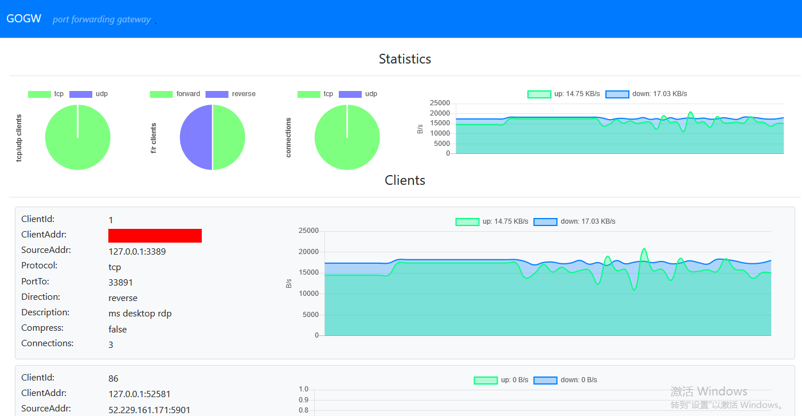

# gogw 

## What's gogw ?
gogw is a port forwarding/reverse forwarding tool over HTTP implements by golang.

* port forwarding/port reverse forwarding
* support TCP/UDP
* pure over HTTP1.1(no WebSocket) to avoid some firewall issues

## How to use ?

### Expose any service(TCP/UDP) behind a NAT or firewall to the internet
Suppose you have a host with public IP 11.11.11.11 and  local host behind a firewall. You run a webservice on your local host port 80 and want others to access it.

1. Edit the config file for gogw server
```json
{
	"Server":{
		"ServerAddr":"0.0.0.0:80",
		"TimeoutSecond": 30
	}
}
```
2. Run gogw server on your public host.
```bash
./gogw -c config.json -r server 
```

3. Edit the config file for your local host to run gogw client.
```json
{
	"Clients":[{
		"ServerAddr":"11.11.11.11:80",
		"SourceAddr":"127.0.0.1:80",
		"ToPort":81,
		"Protocol": "tcp",
		"Direction": "reverse",
		"Description":"webservice",
		"Compress": true
	}]
}
```

4. Run gogw client on your local host.
```bash
./gogw -c config.json -r client
```

Now your can access your web service through ```http://11.11.11.11:81```


### Listen local port and forward packets to remote server as a proxy
Suppose you have a local host A(10.0.0.2), local host B(10.0.0.3) and another host C(11.11.11.11) runing a web server on port 8080. You want the host B access C web server through A.

1. Edit ```config.json``` for gogw server and client.
```json
{
	"Server":{
		"ServerAddr":"0.0.0.0:80",
		"TimeoutSecond": 30
	},
	"Clients":[{
		"ServerAddr":"127.0.0.1:80",
		"SourceAddr":"11.11.11.11:80",
		"ToPort":81,
		"Protocol": "tcp",
		"Direction": "forward",
		"Description":"webservice",
		"Compress": true
	}]
}
```

2. Run gogw server and client on host A
```bash
# run server
./gogw -c config.json -r server

# run client
./gogw -c config.json -r client
```

Now host B can access host C web servie through ```http://10.0.0.2:81```

### Web ui
It has a simple web ui on gogw server. ```http://server_ip:server_port/ui```



### Status
Some functions or code improvements can be added:
* authentication/encryption
* more powerfull ui and monitor
* unit test
* ...

Any contribution is welcome even just a star :)


